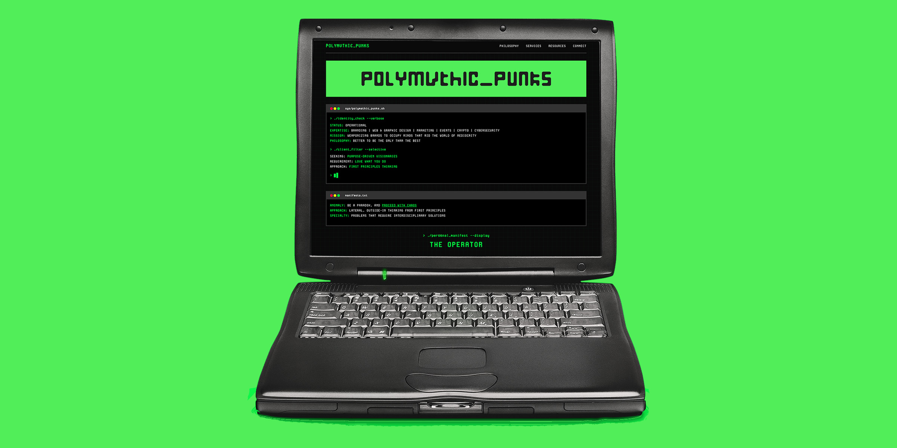
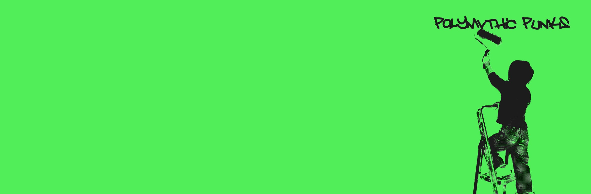

**[POLYMVTHICPUNKS](https://polymvthicpunks.com)** is a Milwaukee-based agency owned & operated by **[CHRIS VRAKAS](https://chrisvrakas.com)** — built from first principles with a purpose-driven, polymathic, and hacker-minded ethos 

**[VIEW LIVE WEBSITE →](https://polymvthicpunks.com)**

---

## 🎯 AGENCY SERVICES

- Web & Graphic Design
- Marketing & Brand Development
- Privacy/Opsec & Cybersecurity
- Cryptocurrency & Related Technologies
- AI Implementation & Automation
- Nightlife, Hospitality, & Music 
- Full-Stack Event Production & Promotion 
- Consultations on all of the ⬆️

---

## ✨ WEBSITE HIGHLIGHTS

- **DESIGN** — minimal grid-based UI / terminal aesthetic / monospace typography & typescale / pixel-perfect design 
- **STACK** — no frameworks, no dependencies, just pure HTML5, CSS3, and Vanilla Java
- **RESPONSIVE** — all screensizes and breakpoints
- **PRIVACY** — zero tracking or analytics, no cookies, no surveillance capitalism bs [view privacy policy here](https://polymvthicpunks.com/pages/privacy/index.html)
- **HOSTING** — Registrar → Cloudflare CDN/DNS/SSL → GitHub Pages & ProtonMail

---

## 📂 TREE

```
polymvthicpunks.com/
├── index.html              # Homepage
├── CNAME                   # Custom domain config
├── robots.txt              # SEO: search engine instructions
├── sitemap.xml             # SEO: site structure
├── BingSiteAuth.xml        # Bing webmaster verification
├── favicon.ico
├── favicon-16x16.png
├── favicon-32x32.png
├── apple-touch-icon.png
├── android-chrome-192x192.png
├── android-chrome-512x512.png
└── assets/
│   ├── css/
│   │   └── style.css       # All styles
│   ├── fonts/              # Cygnito Mono Pro (self-hosted)
│   ├── images/             # Logos, avatars, OG images
│   └── js/
│       └── main.js         # Minimal vanilla JS
└── pages/
    ├── philosophy/         # Philosophy & manifesto
    ├── services/           # Services offered
    ├── resources/          # Redirects → chrisvrakas.com/resources.html
    ├── connect/            # Contact page with PGP
    ├── pgp/                # PGP public key
    └── privacy/            # Privacy policy
```

---

## 💡 PHILOSOPHY 

> WHY FIT IN WHEN YOU WERE BORN TO STAND OUT? -Dr. Suess 

I believe that the future will belong to those non-obvious thinkers who use their wide-ranging powers of interdisciplinary exploration to see connections between multiple, seemingly unrelated domains. 



You're a cultural anomaly and I am your asymmetrical advantage. 

I am on a **MISSION** to help purpose-driven brands become gold-standard "niches of one" that stand the test of time.
                    

---

## 📬 CONNECT

Email: [freedom@chrisvrakas.com](mailto:freedom@chrisvrakas.com)

*note: this email is hosted at [Proton Mail](https://proton.me/mail)*

For encrypted communications, consider using my **PGP KEY** - [chrisvrakas.com](https://chrisvrakas.com/assets/pgp/chris-vrakas-public-key.asc).

**Fingerprint:** `0AD1 B833 73CE A598 682A 8ADC FCB5 ADD3 8E5E 4895`

- Website: [chrisvrakas.com](https://chrisvrakas.com)
- Github: [@chrisvrakas](https://github.com/chrisvrakas)
- X: [@chris_vrakas](https://x.com/chris_vrakas)
- Medium: [@chrisvrakas](https://medium.com/@chrisvrakas)
- Instagram: [@chris_vrakas](https://instagram.com/chris_vrakas)

---

## 📄 License

**When everyone copyrights, copyleft.**

This project is open source and available under the [MIT License](LICENSE) 

---

<div align="center">

*"jvck of all trades, master of many"*

**[VISIT POLYMVTHIC PUNKS →](https://polymvthicpunks.com)**

</div>
